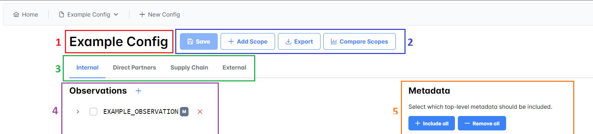
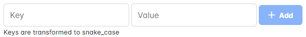
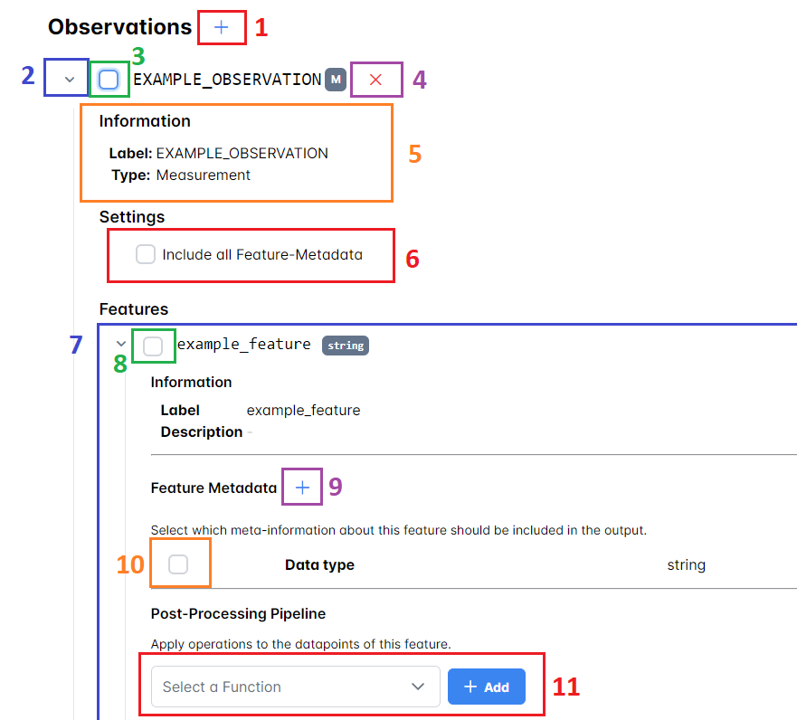
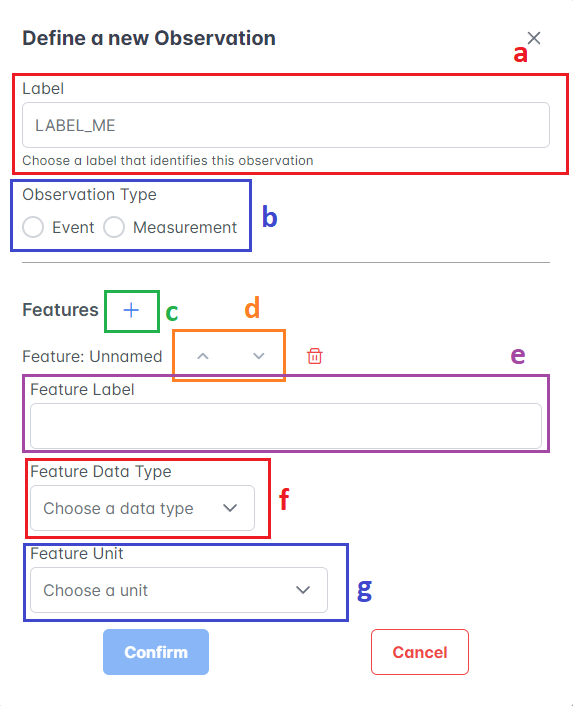

# User Manual

## Running the application

The app is started by double clicking `main_win.exe` in the `main` directory.
When run for the first time, the application may asks for some permissions, these must be granted.

A terminal window opens. When you see the line "uvicorn running on <url>" the app is ready.
Open a webbrowser and nagivate to the displayed url. If the url shown in the
terminal is `0.0.0.0`, replace this with `localhost` or `127.0.0.1`.

To shut down the app, highlight the terminal window and press ctrl+c.

## Terminology

- **Model**: When we refer to model, we mean our datamodel of machine data. The model consists of a *payload* containing the data points and a *header* where the datapoints are described with contextual information. Furthermore the header contains some top-level meta information that do not describe single data points but can give additional contextual information about the data as a whole (e.g. their origin).
- **Scope**: A level of sensitivity. A config typically has different scopes that represent different requirements for sesitivity.
- **Observation**: A bundle of related data that was recorded during the process. An observation is made of a label and a finite number of *features*
- **Feature**: A single data point.

## Creating a Config

- Click "New Config" in the toolbar to access the config-creating view.
- The first step allows to optionally upload a model. If a model is uploaded, the contained meta information are displayed in the editor.
- In the second step an already existing config can be uploaded. 
    - If no config is uploaded but a model was provided during the previous step, a default config for the model will be generated.
- The third step contains a summary of what was provided and requires a name under which the config can be accessed in the application.
- On successful creation of the config, the app opens the config in the editor.

## Editing a Config

- The editor view is opened by hovering the config name one wants to edit in the toolbar and click on "Edit Config".

The view displays the config's name (1), a button-row (2), a tab-list of the config's scopes (3) and the editor for the observations (4) as well as the top-level metadata (5)

### Button Row

- **Save**: Saves the current state of the config.
- **Add scope**: Add an additional scope to the config. Allows to copy the config values of an already existing scope.
- **Export**: Export the currently saved config to a yaml file
- **Compare Scopes**: Display a tabular overview of config values selected for the different scopes.

### Scope Tab List

Clicking a scope name selects this scope for editing. The currently selected scope is hightlighted in the tab list.

### Metadata Editor

Displays the top-level metadata of the model. Top level metadata for the currently selected scope is done via the checkbox.

Custom metadata can be added to the model by entering the key and the value into the input field and clicking the "Add" button.

To remove metadata from the model, right-click the respective entry and select "Delete"

### Observation Editor

The observation editor displays the different observations that the model contains.
Information (5) and Settings (6) about the observation can be toggled on and off (2).

- An observation can be included/excluded from the scope by toggling the checkbox (3).
- The features that make up the observation (7) can be in- and excluded independently via a checkbox (8)
- The feature metadata that should be included can be controlled via the checboxes next to the feature metadata (10)
- Additional feature metadata can be also be added (9). Feature Metadata describes contextual information about the featute itself (descriptive feature metadata) or information about the feature's payload values e.g. statistical information (value metadata).
- The payload data can be processed by transformation functions which are selectable via a dropdown menu (11). Multiple transformation functions may be chained into a pipeline. The functions are applied in order.

#### Adding Observations

New observations can be added via the "+" button next to the "Observations" Heading (1)

- An observation required a label (a) by which the observation is identified. observation labels are denoted in UPPER_SNAKE_CASE
- The observation type (b) is either "Event" for discrete and rarely occuring things and "Measurement" for (continuous) sensor readings.
- An observation usually consists of one or more features which can be defined via (c). The order of features can be altered using the up and down-buttons (d)
- Each feature needs a label by which it is identified (e)
- Additionally features have a data-type (f) which is either numeric (int, float, ), a timestamp or a string of text and an optional (physical) unit (g).